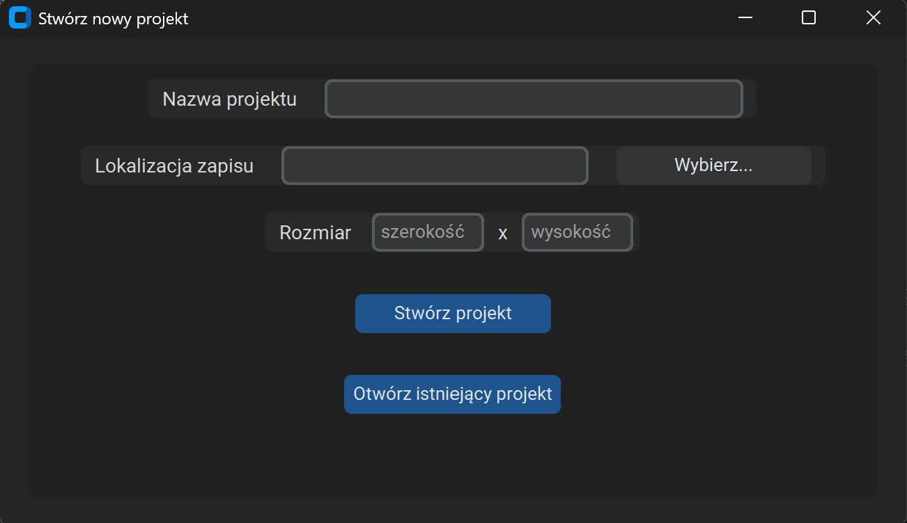
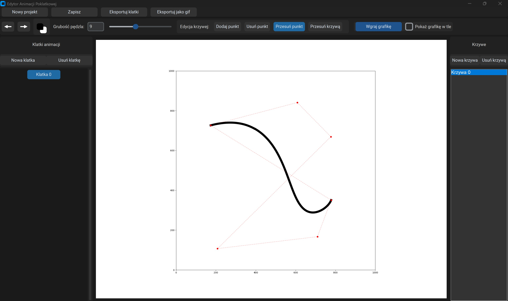

# bezier-stop-motion
A desktop application for creating stop-motion animations using Bézier curves.

## Application:

## File Structure:

### `main.py`
The main application entry point.  
Handles program execution, project creation and loading, graphical user interface (GUI) interactions, Bézier curve editing, frame management, and exporting animations to PNG and GIF formats.

### `bezier_curve.py`
Module responsible for calculating Bézier curve points.  
Contains the core mathematical functions required to generate the curve path based on control points.

### `export.py`
Handles exporting all animation frames to PNG files.  
Each frame is saved as a separate image within the designated project directory.

### `export_index.py`
Manages the export of a single selected frame or all frames.  
Used primarily to generate a preview of the previous frame while working on the animation timeline.

### `gif.py`
Module responsible for creating a GIF animation from previously exported PNG frames.  
Stitches consecutive images into a single GIF file with a specified frame delay.

### `save_project.py`
Handles saving and loading project data.  
Stores information about the canvas size, frame list, and other necessary data required to restore the workspace in future sessions.

## Algorithmic Foundation & Optimization

Instead of using the standard de Casteljau's algorithm (which has a quadratic time complexity of $\mathcal{O}(N^2)$), this application implements a highly optimized algorithm with a linear time complexity of $\mathcal{O}(N)$ for rendering curve paths.

The curve calculation logic is based on the fast evaluation method for Bézier curves proposed in academic research by dr hab. Paweł Woźny and dr Filip Chudy from the University of Wrocław (e.g., *"Fast evaluation of Bézier curves"*). 
Utilizing this approach significantly optimizes the frame generation process and ensures smooth, real-time curve manipulation.

## Known Technical Debt (Lessons Learned)

This was my first major custom application, which explains its procedural structure and reliance on global variables for state management. 
If I were to rewrite it today, I would implement a fully Object-Oriented Programming (OOP) approach. Encapsulating the logic within classes would eliminate global variables, improve component testability, and establish a clear separation between the User Interface (UI) and business logic. 
I am intentionally leaving the code in its original form as a benchmark for my progress.

## Timelapse of the creation process
<video src="timelaps.mov" controls="controls" muted="muted" width="800">
  Your browser does not support the video tag.
</video># bezier-stop-motion
A desktop application for creating stop-motion animations using Bézier curves.

## Application:

## File Structure:

### `main.py`
The main application entry point.  
Handles program execution, project creation and loading, graphical user interface (GUI) interactions, Bézier curve editing, frame management, and exporting animations to PNG and GIF formats.

### `bezier_curve.py`
Module responsible for calculating Bézier curve points.  
Contains the core mathematical functions required to generate the curve path based on control points.

### `export.py`
Handles exporting all animation frames to PNG files.  
Each frame is saved as a separate image within the designated project directory.

### `export_index.py`
Manages the export of a single selected frame or all frames.  
Used primarily to generate a preview of the previous frame while working on the animation timeline.

### `gif.py`
Module responsible for creating a GIF animation from previously exported PNG frames.  
Stitches consecutive images into a single GIF file with a specified frame delay.

### `save_project.py`
Handles saving and loading project data.  
Stores information about the canvas size, frame list, and other necessary data required to restore the workspace in future sessions.

## Algorithmic Foundation & Optimization

Instead of using the standard de Casteljau's algorithm (which has a quadratic time complexity of $\mathcal{O}(N^2)$), this application implements a highly optimized algorithm with a linear time complexity of $\mathcal{O}(N)$ for rendering curve paths.

The curve calculation logic is based on the fast evaluation method for Bézier curves proposed in academic research by dr hab. Paweł Woźny and dr Filip Chudy from the University of Wrocław (e.g., *"Fast evaluation of Bézier curves"*). 
Utilizing this approach significantly optimizes the frame generation process and ensures smooth, real-time curve manipulation.

## Known Technical Debt (Lessons Learned)

This was my first major custom application, which explains its procedural structure and reliance on global variables for state management. 
If I were to rewrite it today, I would implement a fully Object-Oriented Programming (OOP) approach. Encapsulating the logic within classes would eliminate global variables, improve component testability, and establish a clear separation between the User Interface (UI) and business logic. 
I am intentionally leaving the code in its original form as a benchmark for my progress.

## Timelapse of the creation process
<video src="timelaps.mp4" controls="controls" muted="muted" width="800">
  Your browser does not support the video tag.
</video>